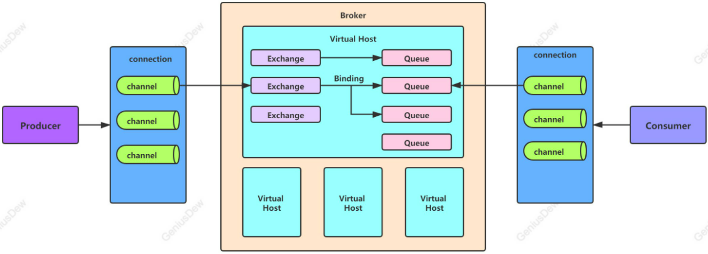

> ## 1、MQ有哪些使用场景？

**异步处理**：用户注册后，发送注册邮件和注册短信。用户注册完成后，提交任务到 MQ，发送模块并行获取 MQ 中的任务。

**系统解耦**：比如用注册完成，再加一个发送微信通知。只需要新增发送微信消息模块，从 MQ 中读取任务，发送消息即可。无

需改动注册模块的代码，这样注册模块与发送模块通过 MQ 解耦。

**流量削峰**：秒杀和抢购等场景经常使用 MQ 进行流量削峰。活动开始时流量暴增，用户的请求写入MQ，超过 MQ 最大长度丢

弃请求，业务系统接收 MQ 中的消息进行处理，达到流量削峰、保证系统可用性的目的。

**日志处理**：日志采集方收集日志写入 kafka 的消息队列中，处理方订阅并消费 kafka 队列中的日志数据。

**消息通讯**：点对点或者订阅发布模式，通过消息进行通讯。如微信的消息发送与接收、聊天室等。

> ## 2、简单介绍一些Rabbitmq的架构？

架构如下所示：

 

消息的发送消息流程：

1、生产者和Rabbitmq服务端建立连接，然后获取通道

2、生产者发送消息发送给指定的虚拟机中的交换机

3、交换机根据消息的routingKey将消息转发给指定的队列

消费者消费消息流程：

1、消费者和Rabbitmq服务端建立连接，然后获取通道

2、消费者监听指定的队列

3、一旦队列有消息了此时就会把消息推送给指定的消费者

> ## 3、Rabbitmq中交换机的类型有哪些？

主要有以下4种：

**fanout**: 把所有发送到该交换器的消息路由到所有与该交换器绑定的队列中。

**direct**:把消息路由到BindingKey和RoutingKey完全匹配的队列中。

**topic**: 匹配规则：

​	RoutingKey 为一个 点号'.': 分隔的字符串。比如: java.xiaoka.show

​	BindingKey和RoutingKey一样也是点号“.“分隔的字符串。

​	BindingKey可使用 * 和 # 用于做模糊匹配，*匹配一个单词，#匹配多个或者0个

**headers**:不依赖路由键匹配规则路由消息。是根据发送消息内容中的headers属性进行匹配。性能差，基本用不到。

> ## 4、如何保证消息不被重复消费?

消息重复消费的原因：

1、生产者发送消息的时候，在指定的时间只能没有得到服务端的反馈，此时触发了重试机制，在Rabbitmq服务端就会出现重

复消费，那么消费者在进行消费的时候就出现了重复消费。

2、消费者消费完毕以后，消费方给MQ确认已消费的反馈，MQ 没有成功接受。该消息就不会从Rabbitmq删除掉，那么消费

者再一次获取到了消息进行消费。

MQ是无法保证消息不被重复消费的，只能业务系统层面考虑。不被重复消费的问题，就被转化为消息**消费的幂等性**的问题。幂

等性就是指一次和多次请求的结果一致，多次请求不会产生副作用。

保证消息消费的幂等性可以考虑下面的方式：

① 给消息生成全局 id，消费成功过的消息可以直接丢弃

② 消息中保存业务数据的主键字段，结合业务系统需求场景进行处理，避免多次插入、是否可以根据主键多次更新而并不影响

结果等

> ## 5、如何保证消息不丢失？

消息丢失的发送的时机：

1、生产者发送消息的时候，由于网络抖动导致消息没有发送成功

2、消息发送到Rabbitmq的以后，Rabbitmq宕机了

3、消费者获取到MQ中的消息以后，还没有及时处理，此时消费者宕机了

解决方案：

1、生产者发送消息：主流的MQ都有**确认机制或事务机制**，可以保证生产者将消息送达到 MQ。如 RabbitMQ 就有事务模式

和 confirm模式。

2、MQ 丢失消息：开启 MQ 的持久化配置(消息、队列都需要进行持久化)。

3、消费者丢失消息：改为手动确认模式，消费者成功消费消息再确认。

> ## 6、如何保证消息的顺序性？

Rabbtimq：

1、将多个消息发送到一个队列中，队列本身就是先进先出的结构

2、避免多消费者并发消费同一个 queue 中的消息。

Kafka：

1、将多个消息发送到一个分区中，kafka可以保证一个分区中的消息的有序性

2、避免多消费者并发消费同一个分区中的消息。

> ## 7、消息大量积压怎么解决？

解决方案：

1、针对Rabbitmq可以使用惰性队列，让消息直接存储到磁盘中

2、增加消费者的数量，提升消费者的消费能力

> ## 8、导致的死信的几种原因？

1、消息被拒（Basic.Reject /Basic.Nack) 且 requeue = false。

2、消息TTL过期。

3、队列满了，无法再添加。

> ## 9、什么是延迟队列以及具体的应用场景？

概述：存储对应的延迟消息，指当消息被发送以后，并不想让消费者立刻拿到消息，而是等待特定时间后，消费者才能拿到这

个消息进行消费。

应用场景：订单超时未支付，文章的延迟发送

